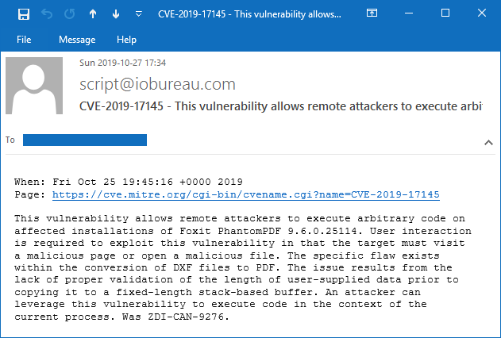

# CVE Monitor

Short and sweet PHP script that relayes new [CVE](https://cve.mitre.org) IDs seen on [@cvenew](https://twitter.com/CVEnew/) 
to a list of email recepients.

## How it works

When run, cve-monitor will:

* Fetch @cvenew stream using
[statuses/user_timeline](https://developer.twitter.com/en/docs/tweets/timelines/api-reference/get-statuses-user_timeline) API
* For each new tweet it will
  * Lightly parse the tweet to get the CVE ID
  * Retrieve the page from cve.mitre.org to get full description
  * Format and send out the email
* Remember the last tweet processed so to request only newer ones on the next run

## Dependencies

* PHP 5.6 and up, CLI version
* [TwitterOAauth](https://github.com/abraham/twitteroauth)
* Consumer API keys from Twitter. This requires opening a [dev account](https://dev.twitter.com) and creating an "app" there. Very easy to do.

Tested on Linux/Debian distro only. Patches for other platforms are welcome.

## Setting it up

First, clone this and [TwitterOAauth](https://github.com/abraham/twitteroauth) repos.

Next, open **cve-monitor.php** and adjust **the config** variables as follows:
* Change `RECEPIENTS` to the email that will receive CVE updates. You can specify multiple recepients like so:

        const RECEPIENTS = [ 'first@acmecorp.com', 'second@acmecorp.com', 'third@acmecorp.com' ];

* Change `EMAIL_ALERT` to the email address that will get pinged with any problems.
* Change `EMAIL_FROM` to what should be used for `From:` in these emails.
 
Next,
* `INI_FILE` stores just the ID of the last processed tweet. Change its location if needed.
* `LOG_FILE` by default sits in `/var/log/` so make sure the script is run under an account that can write there.

Next,
* `TWITTER_OAUTH_PHP` should point at `oauth.php` from the TwitterOAuth repo.
* `TWITTER_API_...` should be set to "Consumer API keys" from "Keys and tokens" section of your Twitter app.

Finally,
* Stick it into your crontab with `php /path/to/cvemon.php` and set it to run every hour.
* Configure rotation for the log file if that's your thing.

That's it.

## Sample email

## License

BSD, 2-clause

## Author

Alex Pankratov, https://swapped.cc
